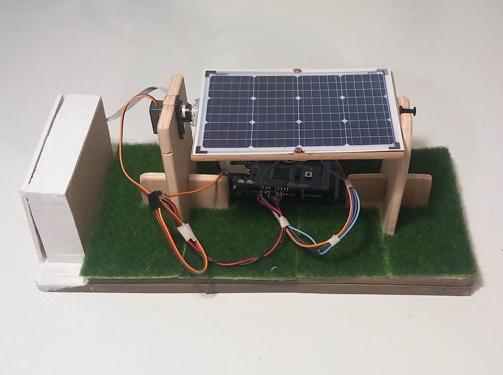
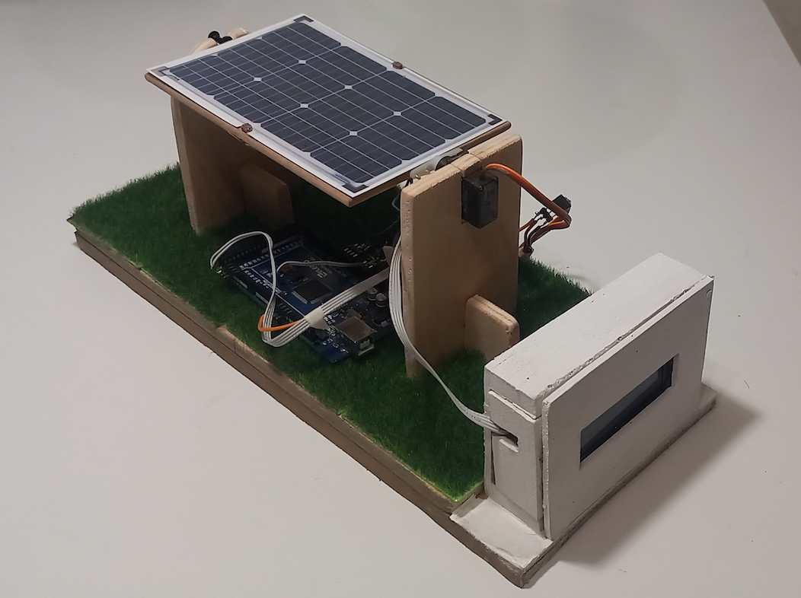
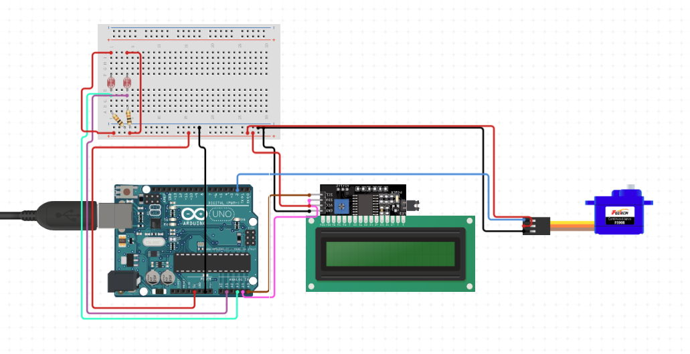
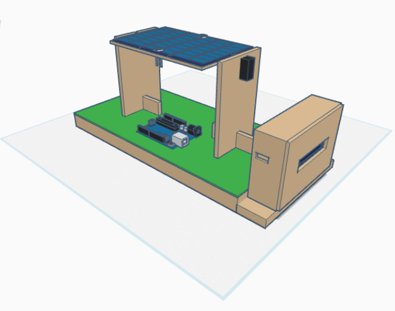
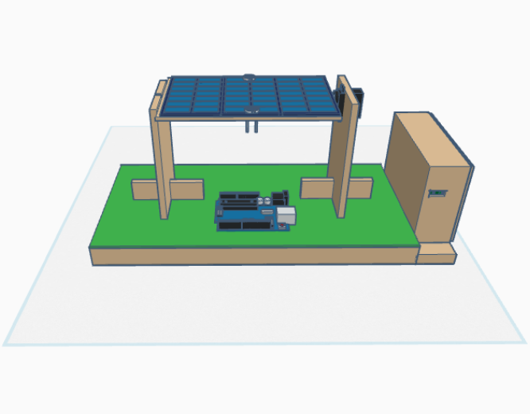

# Arduino Solar Tracker

  
  

## Project Description
This project implements a solar tracker model using Arduino. The system uses two LDR photoresistors to detect light intensity and a servo motor to orient a simulated solar panel towards the most intense light source. An LCD display shows the panel's rotation angle.

## Features
- Automatic solar tracking
- LCD display for rotation angle visualization
- Smooth and precise panel movement
- Implementation of a low-pass filter to reduce oscillations

## Required Components
- Arduino Mega 2560 or compatible
- 2x LDR photoresistors
- 1x Servo motor
- 16x2 I2C LCD Display
- Resistors and connecting wires

## Circuit Diagram

### Connections
The connections in the circuit diagram do not correspond to those made by me, which are:
- Photoresistor 1: Pin A0
- Photoresistor 2: Pin A1
- Servo motor: Pin 9
- LCD Display: I2C (SDA and SCL)

## Code
The complete source code is available in the [SolarTracker.ino](SolarTracker.ino)  file.

## 3D Model
You can access the 3D model made with Tinkercad [here](https://www.tinkercad.com/things/4ZWUIbfD7Xm-arduino-solar-tracker).

  
  

## Demonstration Video

